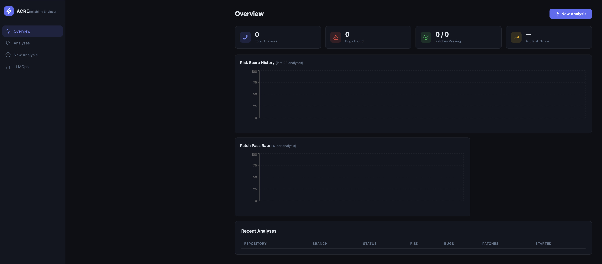
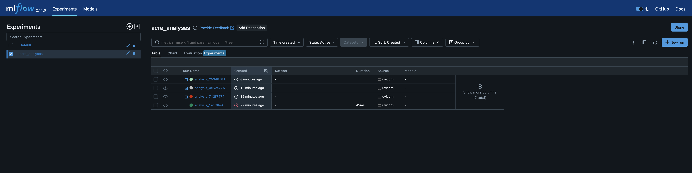
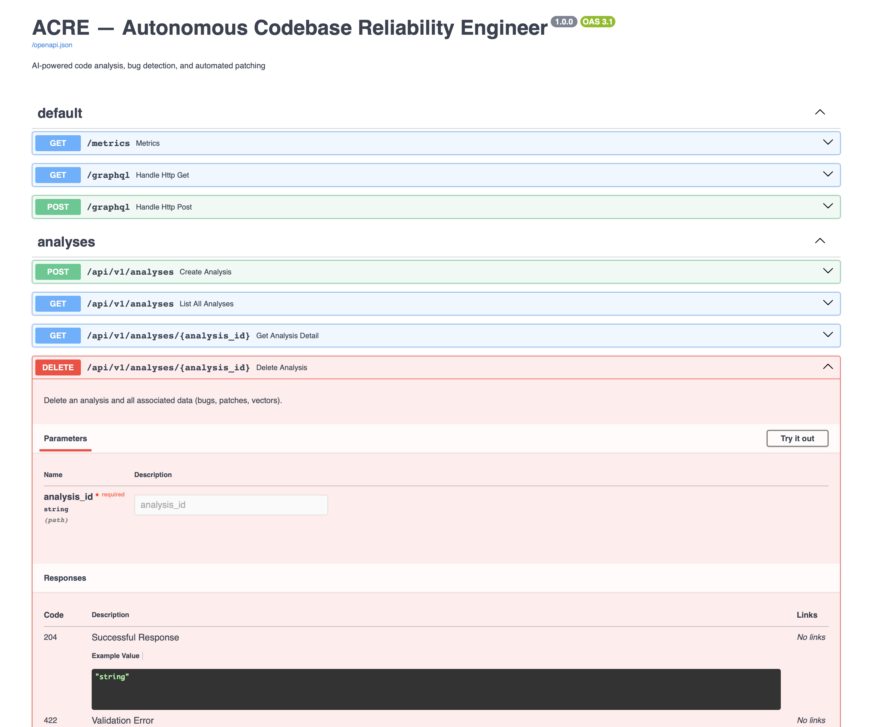

# ACRE — Autonomous Codebase Reliability Engineer

<div align="center">


[](https://python.org)
[](https://fastapi.tiangolo.com)
[](https://langchain-ai.github.io/langgraph)
[](https://mlflow.org)
[](https://react.dev)
[](https://aws.amazon.com)

**An AI platform that reads your codebase the way a senior engineer would — finds the bugs, writes the fixes, tests them in a real sandbox, and tells you exactly what went wrong and why.**

[Features](#what-it-does) · [Architecture](#architecture) · [Quick Start](#quick-start) · [API](#api-usage) · [Screenshots](#screenshots) · [Deployment](#deployment)

</div>

---

## The Problem This Solves

Every engineering team has the same story: bugs slip through code review because reviewers are tired, distracted, or just don't know that part of the codebase well enough. Static analysis tools catch syntax errors but miss the subtle logic bugs — the race conditions, the unhandled edge cases, the security issues hiding in plain sight.

ACRE is my attempt to build something different. Instead of another linter, I wanted a system that actually *understands* code at a structural level — one that can look at a function, reason about what it does, find the flaw in the logic, write a fix, and then prove the fix works by running real tests against it.

It's not a chatbot. It's not a RAG wrapper over documentation. It's an end-to-end AI engineering system for software reliability.

---

## Screenshots

### Dashboard — Real-time Pipeline View

*The overview page tracks risk scores, bug counts, and patch pass rates across all analysed repositories. Numbers update live via WebSocket as agents run.*

### MLflow — LLMOps Experiment Tracking

*Every agent run is tracked in MLflow — prompt versions, retrieval quality, patch success rates, and model versions. The `acre_analyses` experiment shows 4 runs from a single session with timing and source tracked per run.*

### Swagger — Production REST API

*Auto-generated OpenAPI 3.1 docs for every endpoint. Full CRUD on analyses, bugs, and patches, plus a GraphQL layer for complex nested queries.*

---

## What It Does

Point ACRE at any GitHub repository and it runs a full reliability audit:

**Step 1 — Clone and parse.** The repo is cloned with a shallow fetch and parsed using tree-sitter — not naive line-by-line chunking but real AST parsing at the function and class level. Every symbol gets embedded with CodeBERT and stored in ChromaDB for semantic retrieval.

**Step 2 — Detect bugs in three layers.** First deterministic: Semgrep with OWASP rules and Bandit for Python security. Then semantic: GPT-4o reasons over the highest-complexity chunks and flags logic bugs, security issues, and reliability risks. Then pattern-based: RAG search over known anti-patterns like SQL injection, path traversal, and race conditions.

**Step 3 — Generate patches.** A fine-tuned CodeLlama-7B runs as the primary patch model. GPT-4o handles complex multi-file changes. Every patch comes out as a proper unified diff with a confidence score and risk level.

**Step 4 — Test the patches.** An ephemeral Docker container spins up, the patch is applied, generated pytest cases run against it, and the result is scored. No hallucinating whether something works — it either passes or it doesn't.

**Step 5 — Track everything.** Every prompt version, agent run, retrieval quality score, and model version is logged to MLflow. The whole system is observable and reproducible.

**Step 6 — Expose results.** REST, GraphQL, and WebSocket. The React dashboard shows bugs sorted by severity, patches with their diffs and eval results, and risk score history over time.

---

## Architecture

```
┌─────────────────────────────────────────────────────────────────────┐
│                         GitHub Repository                           │
│                    (push webhook or manual trigger)                 │
└───────────────────────────────┬─────────────────────────────────────┘
                                │
                    ┌───────────▼────────────┐
                    │    Ingestion Service    │
                    │       port 8080         │
                    │                        │
                    │  git clone (shallow)   │
                    │  tree-sitter AST       │
                    │  CodeBERT embeddings   │
                    │  ChromaDB upsert       │
                    └───────────┬────────────┘
                                │
                         vectors + metadata
                                │
                    ┌───────────▼────────────┐
                    │   Agent Orchestrator   │
                    │   LangGraph Pipeline   │
                    │       port 8082        │
                    │                        │
                    │  ┌──────────────────┐  │
                    │  │  1. Analyzer     │◄─┤─ architecture map
                    │  └────────┬─────────┘  │  complexity hotspots
                    │           │            │
                    │  ┌────────▼─────────┐  │
                    │  │  2. Bug Detector │◄─┤─ Semgrep + Bandit
                    │  └────────┬─────────┘  │  GPT-4o semantic
                    │           │            │  RAG anti-patterns
                    │  ┌────────▼─────────┐  │
                    │  │  3. Patch Gen    │◄─┤─ CodeLlama-7B LoRA
                    │  └────────┬─────────┘  │  GPT-4o fallback
                    │           │            │
                    │  ┌────────▼─────────┐  │
                    │  │  4. Test Gen     │◄─┤─ pytest scaffolding
                    │  └────────┬─────────┘  │
                    │           │            │
                    │  ┌────────▼─────────┐  │
                    │  │  5. Evaluator    │◄─┤─ Docker sandbox
                    │  └────────┬─────────┘  │  PASS / PARTIAL / FAIL
                    │     ┌─────┘            │
                    │     │ failed?          │
                    │     └──► retry (x2)   │
                    │           │            │
                    │  ┌────────▼─────────┐  │
                    │  │  6. Report       │◄─┤─ risk score + JSON
                    │  └──────────────────┘  │  MLflow log
                    └───────────┬────────────┘
                                │
                    ┌───────────▼────────────┐
                    │      API Gateway       │
                    │       port 8000        │
                    │                        │
                    │  FastAPI REST          │
                    │  Strawberry GraphQL    │
                    │  WebSocket relay       │
                    │  Celery task queue     │
                    └────────────┬───────────┘
                                 │
           ┌─────────────────────┼──────────────────┐
           │                     │                  │
  ┌────────▼──────┐   ┌──────────▼──────┐  ┌───────▼────────┐
  │  React        │   │  MLflow UI      │  │  Prometheus    │
  │  Dashboard    │   │  port 5001      │  │  + Grafana     │
  │  port 3000    │   │  LLMOps         │  │  port 3001     │
  └───────────────┘   └─────────────────┘  └────────────────┘
```

### Infrastructure

```
Local Dev                          Production (AWS)
─────────                          ────────────────
Docker Compose                     EKS (Kubernetes)
  postgres:5432          ───────►    RDS PostgreSQL (Multi-AZ)
  redis:6379             ───────►    ElastiCache Redis
  chromadb:8001          ───────►    ChromaDB on EKS
  mlflow:5001            ───────►    MLflow on EKS
                                     S3 (snapshots + artifacts)
                                     ECR (container images)
                                     ALB (ingress)
                                     GPU nodes (fine-tuning jobs)

CI/CD: GitHub Actions
  push to main
    → pytest + mypy + eslint
    → docker build (matrix: 4 services)
    → push to ECR
    → kubectl rolling deploy
    → smoke test
    → Slack notify
```

---

## Tech Stack

| Layer | Technology | Why |
|---|---|---|
| Multi-Agent Orchestration | LangGraph | Stateful graph with retry loops and conditional edges |
| Code Parsing | tree-sitter | Real AST at function/class level, not naive text splitting |
| Vector Store | ChromaDB | Fast semantic search, metadata filtering by file/type |
| Embeddings | CodeBERT (microsoft/codebert-base) | Code-specific semantics, better than generic text models |
| LLM | OpenAI GPT-4o | Primary reasoning, architecture analysis, patch generation |
| Fine-tuning | PEFT / LoRA on CodeLlama-7B | Cheaper inference, improves on domain-specific bug-fix pairs |
| LLMOps | MLflow 2.14 | Prompt versioning, run lineage, model registry |
| Backend API | FastAPI 0.111 | Async, auto-docs, WebSocket support built in |
| GraphQL | Strawberry | Type-safe schema, nested resolvers, playground |
| Task Queue | Celery + Redis | Async pipeline execution, retry logic, rate limiting |
| Database | PostgreSQL (asyncpg) | Analyses, bugs, patches, eval results — all relational |
| Frontend | React 18 + Recharts | Real-time dashboard, WebSocket hook, chart library |
| Containers | Docker + Kubernetes | Service isolation, horizontal scaling, GPU job support |
| Cloud | AWS EKS + S3 + ECR + RDS | Battle-tested, IRSA for fine-grained IAM |
| IaC | Terraform | Reproducible infra, state in S3 backend |
| Monitoring | Prometheus + Grafana | Service-level metrics, custom dashboards |
| CI/CD | GitHub Actions | Matrix builds, ECR push, EKS rolling deploy |

---

## Project Structure

```
acre/
├── services/
│   ├── ingestion/              # Cloning + parsing + vectorization
│   │   ├── main.py             # FastAPI app, async pipeline
│   │   ├── github_loader.py    # Shallow clone, token auth
│   │   ├── ast_parser.py       # tree-sitter + regex fallback
│   │   ├── vector_store.py     # ChromaDB with CodeBERT
│   │   └── s3_client.py        # Async snapshot upload
│   │
│   ├── agents/                 # LangGraph pipeline
│   │   ├── orchestrator.py     # Graph + MLflow wrapping
│   │   ├── state.py            # BugReport, Patch dataclasses
│   │   └── agents/
│   │       ├── analyzer.py     # Architecture map + complexity
│   │       ├── bug_detector.py # Static + LLM + RAG detection
│   │       ├── patch_generator.py  # CodeLlama/GPT-4o + diffs
│   │       ├── test_generator.py   # pytest case generation
│   │       └── evaluator.py    # Docker sandbox + scoring
│   │
│   ├── api/                    # API Gateway
│   │   ├── main.py             # FastAPI + WebSocket relay
│   │   ├── db.py               # SQLAlchemy async models
│   │   ├── celery_tasks.py     # Background jobs
│   │   ├── auth.py             # JWT + API key auth
│   │   ├── gql/schema.py       # Strawberry GraphQL
│   │   └── routers/            # analyses, patches, repos, webhooks
│   │
│   └── finetuning/
│       └── train.py            # PEFT/LoRA pipeline + eval
│
├── dashboard/src/
│   ├── pages/
│   │   ├── OverviewPage.tsx        # Global stats + charts
│   │   ├── AnalysisDetailPage.tsx  # Pipeline + bugs + patches
│   │   └── NewAnalysisPage.tsx     # Trigger form
│   ├── hooks/useWebSocket.ts       # Real-time event hook
│   └── lib/api.ts                  # Axios + GraphQL client
│
├── mlflow/mlflow_config.py     # PromptRegistry + run tracking
├── k8s/all-services.yaml       # Deployments + HPA + Ingress
├── terraform/main.tf           # AWS EKS, RDS, ElastiCache, S3, ECR
├── monitoring/prometheus.yml   # Scrape configs
├── docker-compose.local.yml    # Local infrastructure only
└── .github/workflows/ci-cd.yml # Full CI/CD pipeline
```

---

## Quick Start

### Prerequisites

- Python 3.11
- Node.js 20
- Docker Desktop (running)
- OpenAI API key — [platform.openai.com/api-keys](https://platform.openai.com/api-keys)
- GitHub Personal Access Token — [github.com/settings/tokens](https://github.com/settings/tokens) (tick `repo` scope)

### 1. Clone and configure

```bash
git clone https://github.com/Ishmeet13/acre.git
cd acre

cp .env.local .env
# Edit .env — set OPENAI_API_KEY and GITHUB_TOKEN
```

### 2. Start infrastructure (Docker)

```bash
docker compose -f docker-compose.local.yml up -d
# Starts: Postgres :5432, Redis :6379, ChromaDB :8001, MLflow :5001
```

### 3. Install Python + Node dependencies

```bash
# API Gateway
cd services/api && python3.11 -m venv .venv && source .venv/bin/activate
pip install -r requirements.txt && deactivate && cd ../..

# Ingestion Service
cd services/ingestion && python3.11 -m venv .venv && source .venv/bin/activate
pip install -r requirements.txt && deactivate && cd ../..

# Agents Service
cd services/agents && python3.11 -m venv .venv && source .venv/bin/activate
pip install -r requirements.txt && deactivate && cd ../..

# Dashboard
cd dashboard && npm install && cd ..
```

### 4. Start all services (5 terminals)

```bash
# T1 — API Gateway
cd services/api && source .venv/bin/activate
export MLFLOW_TRACKING_URI=http://localhost:5001
export $(cat ../../.env | grep -v '#' | grep -v '^$' | xargs)
uvicorn main:app --host 0.0.0.0 --port 8000 --reload

# T2 — Ingestion Service
cd services/ingestion && source .venv/bin/activate
export $(cat ../../.env | grep -v '#' | grep -v '^$' | xargs)
uvicorn main:app --host 0.0.0.0 --port 8080 --reload

# T3 — Agents Service
cd services/agents && source .venv/bin/activate
export MLFLOW_TRACKING_URI=http://localhost:5001
export $(cat ../../.env | grep -v '#' | grep -v '^$' | xargs)
uvicorn main:app --host 0.0.0.0 --port 8082 --reload

# T4 — Celery Worker
cd services/api && source .venv/bin/activate
export MLFLOW_TRACKING_URI=http://localhost:5001
export $(cat ../../.env | grep -v '#' | grep -v '^$' | xargs)
celery -A celery_tasks worker --loglevel=info -Q ingestion,analysis,patching --concurrency=2

# T5 — Dashboard
cd dashboard && npm run dev
```

### 5. Run your first analysis

```bash
curl -X POST http://localhost:8000/api/v1/analyses \
  -H "Content-Type: application/json" \
  -d '{"repo_url": "https://github.com/psf/requests", "branch": "main"}'
```

Open **http://localhost:3000** and watch the pipeline run in real time.

---

## Service URLs

| Service | URL | What's there |
|---|---|---|
| Dashboard | http://localhost:3000 | Real-time pipeline view, bugs, patches |
| API + Swagger | http://localhost:8000/docs | Interactive OpenAPI 3.1 docs |
| GraphQL | http://localhost:8000/graphql | Nested query playground |
| MLflow | http://localhost:5001 | Experiment tracking + model registry |
| Prometheus | http://localhost:9090 | Raw metrics |
| Grafana | http://localhost:3001 | Dashboards (admin/admin) |

---

## API Usage

### REST

```bash
# Trigger analysis
curl -X POST http://localhost:8000/api/v1/analyses \
  -H "Content-Type: application/json" \
  -d '{"repo_url": "https://github.com/psf/requests", "branch": "main"}'

# Get analysis status
curl http://localhost:8000/api/v1/analyses/{analysis_id}

# Get bugs (filter available: severity, bug_type, file_path)
curl "http://localhost:8000/api/v1/analyses/{analysis_id}/bugs?severity=HIGH"

# Get patches
curl http://localhost:8000/api/v1/analyses/{analysis_id}/patches

# Accept a patch
curl -X POST http://localhost:8000/api/v1/patches/{patch_id}/accept
```

### GraphQL

```graphql
query {
  analysis(analysisId: "your-id") {
    repoUrl
    riskScore
    bugsFound
    architectureSummary
    bugs(severity: "HIGH", limit: 10) {
      title
      filePath
      startLine
      severity
      bugType
      rootCause
      suggestedFixDescription
    }
    patches {
      explanation
      unifiedDiff
      confidenceScore
      modelUsed
      evalResult {
        verdict
        testsRun
        testsPassed
        qualityScore
      }
    }
  }
}
```

### GitHub Webhooks

Wire up ACRE to auto-analyse every push and PR:

```
Payload URL:   https://your-domain.com/webhooks/github
Content type:  application/json
Secret:        <GITHUB_WEBHOOK_SECRET from .env>
Events:        Push events, Pull requests
```

---

## Fine-tuning Pipeline

ACRE gets smarter over time. Every patch that passes sandbox evaluation feeds back into the next fine-tuning run — a self-improving loop.

```bash
# Run locally (needs GPU or MPS)
cd services/finetuning
python train.py --epochs 3 --batch-size 4 --data-dir ./training_data

# Or trigger as a K8s Job (runs on GPU node)
kubectl apply -f k8s/finetuning-job.yaml -n acre
```

Training configuration:
- **Base model**: `codellama/CodeLlama-7b-Instruct-hf`
- **Method**: QLoRA (r=16, α=32, 4-bit NF4 quantization via bitsandbytes)
- **Target modules**: q_proj, k_proj, v_proj, o_proj, gate_proj, up_proj, down_proj
- **Training data**: Bug-fix pairs from GitHub + ACRE's own passing patches
- **Evaluation**: BLEU score + syntax validity rate + sandbox pass rate
- **Auto-promotion**: Model promoted to Production in MLflow registry when pass rate ≥ 70%

---

## LLMOps with MLflow

The `acre_analyses` experiment tracks every run end-to-end:

```python
# Every agent node has its own context manager
with track_agent_run("bug_detection", analysis_id) as ctx:
    ctx.log_prompt("system_prompt", SYSTEM_PROMPT, model="gpt-4o")
    ctx.log_retrieval(chunks, query)
    # ... detection runs ...
    ctx.log_outcome(bugs_found=12, quality_score=0.84, wall_time_s=18.3)
```

Metrics tracked per analysis run:
- `bugs_found`, `patches_generated`, `patches_passing`, `risk_score`
- `retrieval_avg_score`, `retrieval_chunks` (per agent node)
- `eval_pass_rate`, `eval_avg_quality`, `patch_attempts`
- `wall_time_s` per node — useful for spotting bottlenecks

---

## Deployment (AWS EKS)

```bash
# 1. Provision infrastructure
cd terraform
terraform init
terraform apply \
  -var="aws_account_id=123456789012" \
  -var="db_password=your-secure-password"

# 2. Build + push all images
for service in api agents ingestion dashboard; do
  docker build -t $ECR_URL/acre-$service:latest services/$service
  docker push $ECR_URL/acre-$service:latest
done

# 3. Deploy
aws eks update-kubeconfig --name acre-eks --region us-east-1
kubectl apply -f k8s/ --namespace acre
kubectl rollout status deployment/api -n acre --timeout=5m
```

The GitHub Actions pipeline in `.github/workflows/ci-cd.yml` handles all of this automatically on every push to `main`.

---

## What I Learned Building This

A few things that surprised me during development:

**Tree-sitter is underrated for AI applications.** The difference between embedding a raw file and embedding at the function level is enormous for retrieval quality. Chunking by AST node means the retrieved context is coherent — a complete function with its signature, docstring, and body, not a random 512-token window that starts mid-loop.

**LangGraph's conditional edges make retry logic elegant.** Being able to route back to patch generation when evaluation fails, with the failed patch IDs in shared state, made the feedback loop robust with almost no extra code. The graph structure makes the control flow explicit and debuggable.

**MLflow for LLMs needs a different mental model.** Traditional ML tracking is about hyperparams and loss curves. For LLMs, what matters is prompt versions, retrieval quality, and output scoring. I built a lightweight `AgentRunContext` abstraction to make per-node tracking feel natural rather than boilerplate.

**The hardest part was evaluation.** Generating plausible patches is relatively easy. Knowing whether a patch is actually correct requires running code — which means sandboxing, which means Docker, which means handling timeouts, syntax errors, import failures, and test framework differences. Getting this right took more iteration than everything else combined.

---

## Roadmap

- [ ] GitHub PR creation from accepted patches
- [ ] Incremental re-analysis on git diff (skip unchanged files)
- [ ] JavaScript/TypeScript semantic analysis support
- [ ] Multi-repo dependency graph analysis
- [ ] Slack/Teams notifications for high-severity bugs
- [ ] Web UI for prompt A/B testing
- [ ] Fine-tuning on JavaScript bug-fix pairs

---

## Author

**Ishmeet Singh Arora**
Master of Applied Computing (AI Specialization) — University of Windsor, graduating December 2025

[GitHub](https://github.com/Ishmeet13) · [LinkedIn](https://linkedin.com/in/ishmeet-singh-arora)

---

## License

MIT — see [LICENSE](LICENSE) for details.
